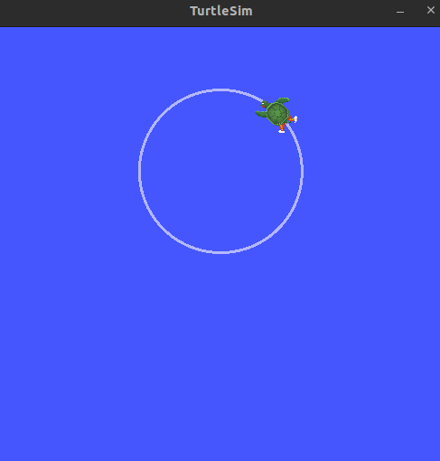
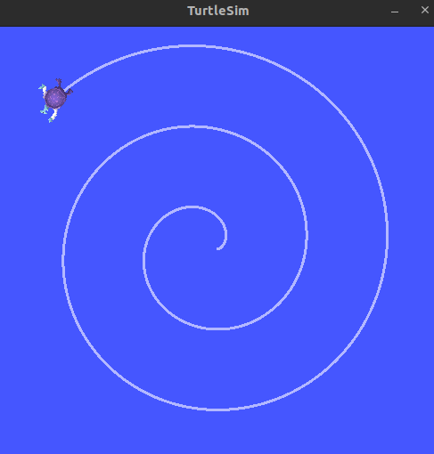
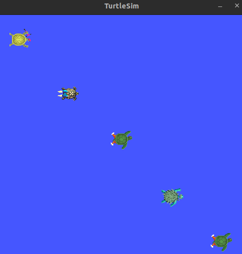
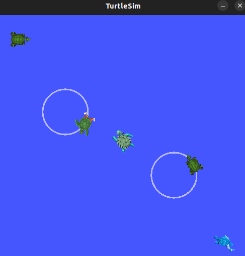
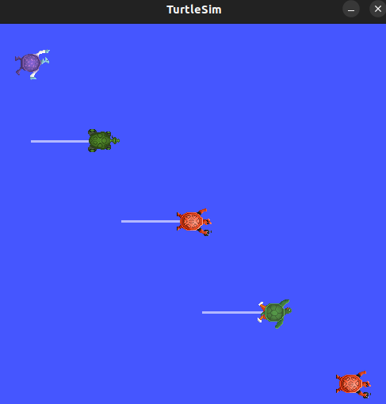
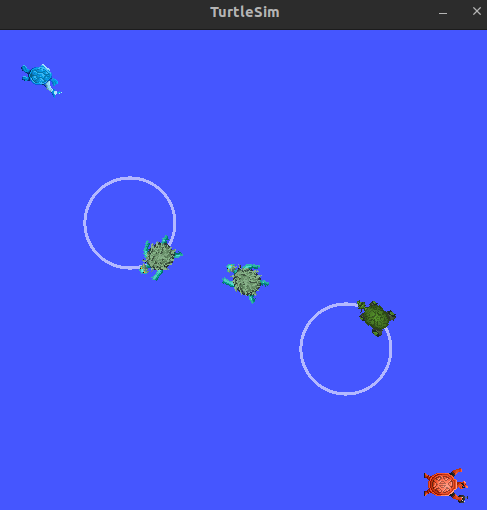

# Module 2 Assignment: Developing Custom ROS 2 Nodes and Launch Files

## Tasks

### Task 1: Create a Custom ROS 2 Node

  - **Circle Movement:** 

      ### How To Run?

      - Perform
         ```
         cd ~/assignment_ws
         colcon build --packages-select module_2_assignment
         source install/setup.bash
         ```
      - Run with these commands
      - Termial 1
         ```
         ros2 run turtlesim turtlesim_node
         ```
      - Termial 2
         ```
         ros2 run module_2_assignment task1
         ```
      - Give Input (Example)
         ```
         Enter the radius of the circle (>0 in meters): 2
         ```
      
      ### Output

      

  - **Logarithmic Spiral Movement:**

      ### How To Run?

      - Run with these commands
      - Termial 1
         ```
         ros2 run turtlesim turtlesim_node
         ```
      - Termial 2
         ```
         ros2 run module_2_assignment task1b
         ```

      ### Output

      
      
### Task 2: Develop a Launch File

- **Create a launch file** 

   ### How To Run?

   - Perform
      ```
      cd ~/assignment_ws
      colcon build --packages-select module_2_assignment
      source install/setup.bash
      ```
   - Run with these commands
   - For Task1A (Circle Movement)
      ```
      ros2 launch module_2_assignment launch_task2.launch.py
      ```
   - For Task1B (Spiral Movement)
      ```
      ros2 launch module_2_assignment launch_task2b.launch.py
      ```

### Task 3: Modify the Turtlesim Simulation Environment

- **Use existing Turtlesim services** 
  - **Spawn 5 Turtlebots**

      ### How To Run?

      - Perform
         ```
         cd ~/assignment_ws
         colcon build --packages-select module_2_assignment
         source install/setup.bash
         ```
      - Run with this command
         ```
         ros2 launch module_2_assignment launch_task3.launch.py
         ```
      
      ### Output

      

  - **Drive the middle 3 turtles** 

  - **Cicular** 
  
      ### How To Run?

      - Run with this command
         ```
         ros2 launch module_2_assignment launch_task3a.launch.py
         ```
      
      ### Output

      

  - **Back and Forth**

      ### How To Run?

      - Run with this command
         ```
         ros2 launch module_2_assignment launch_task3b.launch.py
         ```
      
      ### Output

      

### Task 4: Modify Turtle Behavior with Parameters

- **Utilize ROS 2 parameters**
  - **Change the speed** of the turtles with parameters.

   ### How To Run?

   - Perform
      ```
      cd ~/assignment_ws
      colcon build --packages-select module_2_assignment
      source install/setup.bash
      ```
   - Run with this command
      ```
      ros2 launch module_2_assignment launch_task4.launch.py
      ```
   
   ### Output

   
---