# Module 3 Assignment: URDF and Robot Creation in ROS 2

## Tasks

### Task 1: Create a Custom Transform Tree

- **Design a robotic arm with 3 DOF**
  - **Define the transform tree for the robotic arm**
  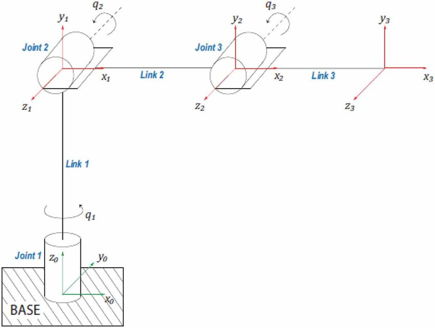
      ### How To Run?

      - Perform
         ```
         cd ~/assignment_ws
         colcon build --packages-select module_3_assignment
         source install/setup.bash
         ```
      - Run with this command
      - Termial 1
         ```
         ros2 launch module_3_assignment task1.launch.py
         ```
      
      ### Output
      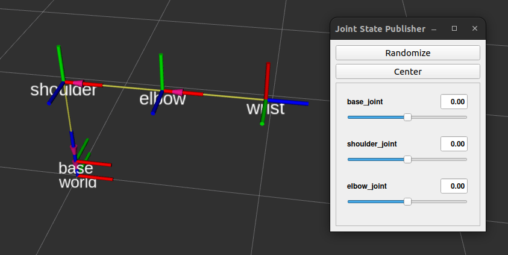
      
      - TF

      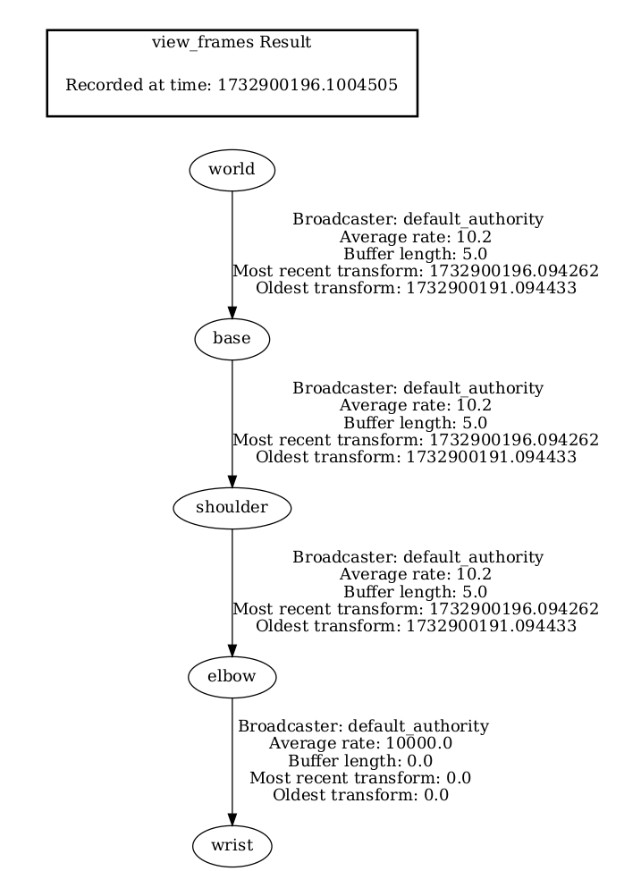
  
### Task 2: Add Joints and Visual Elements

- **Enhance the robotic arm** you created earlier by adding joints:
  - **Finger Joint:** prismatic joint type.
  - **Base Joint:** continuous type.
  - **All Other Joints:** revolute joints.

      ### How To Run?

      - Perform
         ```
         cd ~/assignment_ws
         colcon build --packages-select module_3_assignment
         source install/setup.bash
         ```
      - Run with this command
      - Termial 1
         ```
         ros2 launch module_3_assignment task2.launch.py
         ```
      
      ### Output
      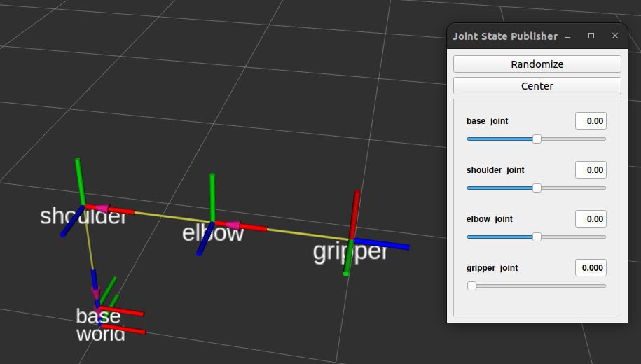
      
      - TF
      
      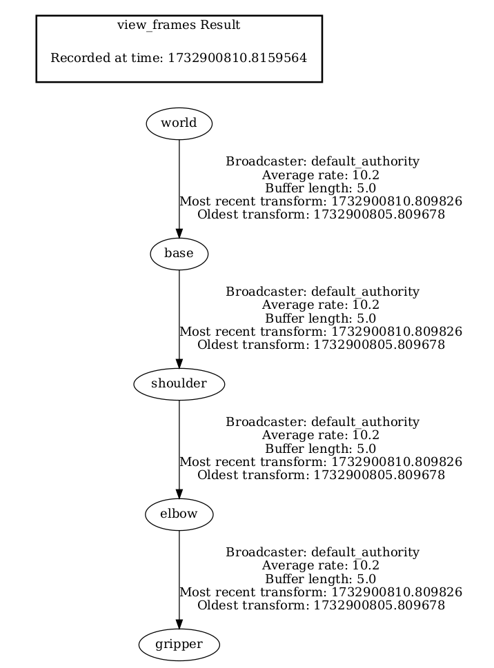

- **Add visualization tags** 

    ### How To Run?

        ```
    - Run with this command
    - Termial 1
        ```
        ros2 launch module_3_assignment task2b.launch.py
        ```
    
    ### Output
    
    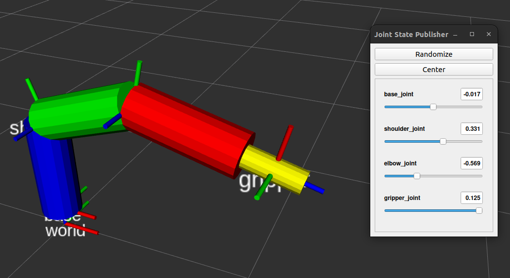
      

### Task 3: Build a Mobile Manipulator

- **Integrate the robotic arm with a mobile robot platform**

    ### How To Run?

    - Perform
        ```
        cd ~/assignment_ws
        colcon build --packages-select module_3_assignment
        source install/setup.bash
        ```
    - Run with this command
    - Termial 1
        ```
        ros2 launch module_3_assignment task3a.launch.py
        ```
    
    ### Output
    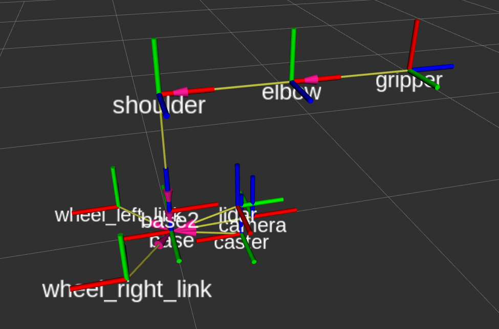
    
    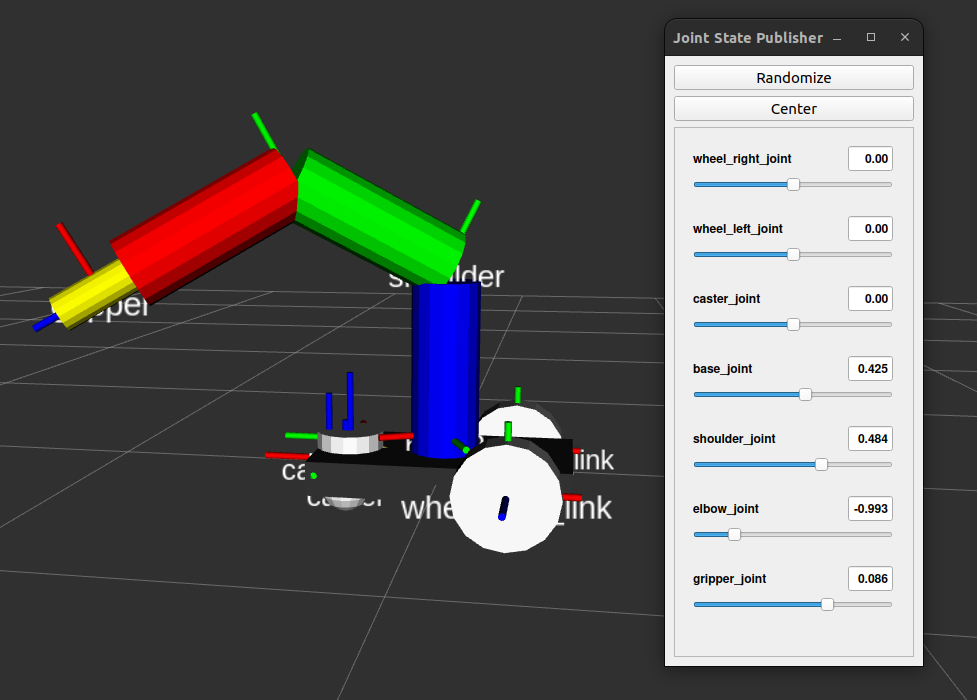
    
    - TF

    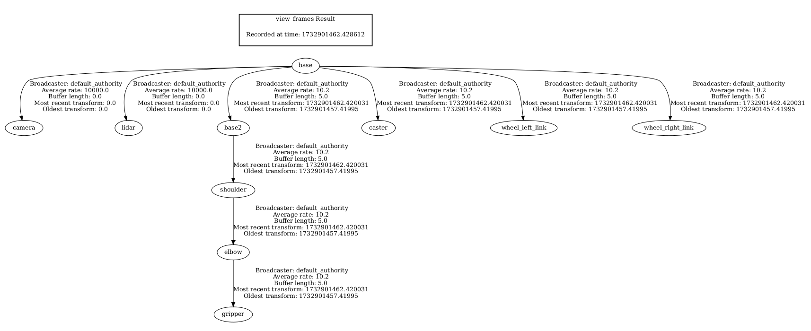

- **Create an Ackerman Drive System:**
  - **Design a car-like robot structure** 
  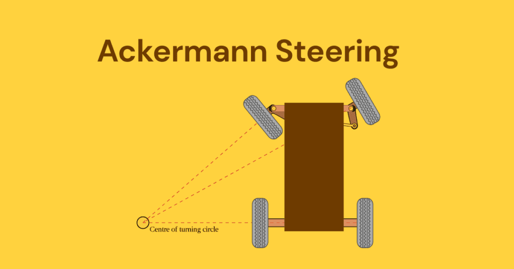
    ### How To Run?

    - Run with these commands
    - Termial 1
        ```
        ros2 launch module_3_assignment task3b.launch.py
        ```
    - Termial 2
        ```
        ros2 launch module_3_assignment task3bgazebo.launch.py
        ```
    ### Output
    
    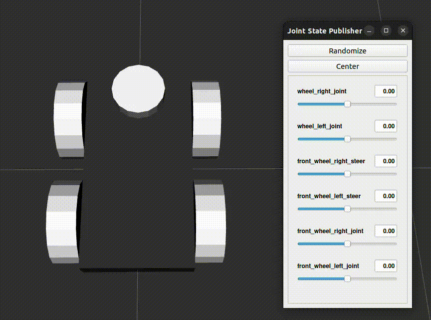

    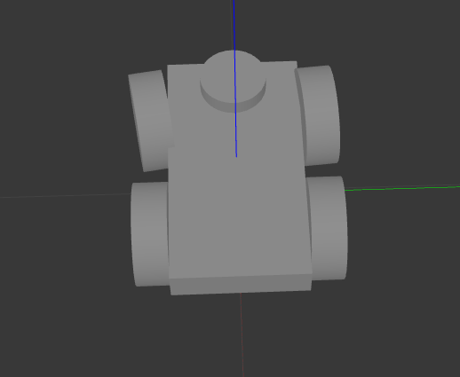
    
    - TF
    
    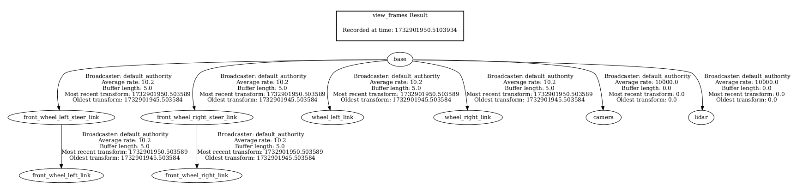
----