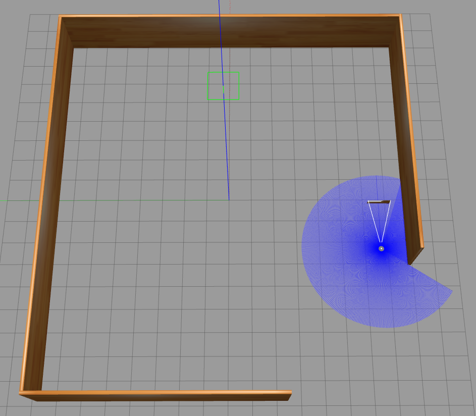

# Module 4 Assignment: Sensor Data Manipulation for Robot Control

## Objective

This assignment is focused on utilizing sensor data to control robots effectively. You will work on restructuring code, designing software flow, and implementing maze-solving and line-following behaviors in a simulated environment using ROS 2 and Gazebo. You will also learn how to debug and fix errors in your code.

## Tasks

### Task 1: Restructure Line Following Project Code

- **Naming Convention** 

    

- **ClassName** 
    ```
    LineFollowing
    ```
- **_classVariables** 
    ```
    _publisher
    _subscription
    _angularVel
    _velocityMsg
    _cannyImage
    _robotMidPoint
    _midPoint
    ```
- **functionNames** 
    ```
    cameraCallback
    analyzeImage
    determineMidPoint
    calculateError
    ```
- **localVariables_**
    ```
    grayImage_
    lowerThreshold_
    upperThreshold_
    row_
    column_
    edge_
    midArea_
    roi_
    error_
    ```
- **File Name** 
    ```
    task_1.cpp
    ```

### Task 2: Design Software Flow for Maze Solving

- **Software flow design**

.png>)

### Task 3: Implement Maze Solving in Gazebo

- **Create a maze environment - Square Shape** 

### How To Run?

- Perform
    ```
    cd ~/assignment_ws
    colcon build --packages-select module_4_assignment
    source install/setup.bash
    ```
- Run with this command
- Termial 1
    ```
    ros2 launch module_4_assignment task3a.launch.py
    ```



- **Detect the wall on the right - Wall Following Behaviour**

### How To Run?

- Run with this command
- Termial 1
    ```
    ros2 launch module_4_assignment task3b.launch.py
    ```

### WATCH task3b.mp4 Video (4x - Speed)

<video controls src="task3b.mp4" title="Title"></video>

- **Utilize TurtleBot3’s IMU sensor** 
  - **Calculate Velocity** - /odom
  - **Calculate Acceleration** - /imu

### How To Run?

- Run with these command
- Termial 1
    ```
    ros2 launch turtlebot3_gazebo empty_world.launch.py
    ```
- Termial 2
    ```
    ros2 run teleop_twist_keyboard teleop_twist_keyboard
    ```
- Termial 3
    ```
    ros2 run robot_module_4_assignment task3c
    ```

Move Robot using Teleop

### Output

[INFO] [1733081945.298053793] [robot_metrics]: Linear Acceleration: -0.09 m/s²

[INFO] [1733081945.389238391] [robot_metrics]: Linear Velocity: 0.00 m/s

[INFO] [1733081945.798443594] [robot_metrics]: Linear Acceleration: 4.69 m/s²

[INFO] [1733081945.899416954] [robot_metrics]: Linear Velocity: 0.34 m/s

[INFO] [1733081946.299380056] [robot_metrics]: Linear Acceleration: -0.06 m/s²

[INFO] [1733081946.410362854] [robot_metrics]: Linear Velocity: 0.50 m/s

[INFO] [1733081946.799619705] [robot_metrics]: Linear Acceleration: 0.04 m/s²

[INFO] [1733081946.920701276] [robot_metrics]: Linear Velocity: 0.02 m/s

[INFO] [1733081947.300389607] [robot_metrics]: Linear Acceleration: -0.06 m/s²

[INFO] [1733081947.431294248] [robot_metrics]: Linear Velocity: 0.00 m/s

### Task 4: Fix Errors in Launch Files

### camera_line_following.launch.py
### How To Run?

- Perform
    ```
    cd ~/assignment_ws
    colcon build --packages-select robot_sensing_debug
    source install/setup.bash
    ```
- Run with this command
- Termial 1
    ```
    ros2 launch robot_sensing_debug camera_line_following.launch.py
    ```
### ERROR0


### How To Fix?


- Change this block of code in "camera_line_following.launch.py"

    ```
    world = os.path.join(
        get_package_share_directory('robot_sensing'),
        'worlds',
        'line_following.world'
    )

    line_following = Node(
        package = 'robot_sensing',
        name = 'line_following',
        executable ='lineFollowing',

    )
    ```
- To

    ```
    world = os.path.join(
        get_package_share_directory('robot_sensing_debug'),
        'worlds',
        'line_following.world'
    )

    line_following = Node(
        package = 'robot_sensing_debug',
        name = 'line_following',
        executable ='lineFollowing',

    )
    ```
- Perform
    ```
    cd ~/assignment_ws
    colcon build --packages-select robot_sensing_debug
    source install/setup.bash
    ```
- Run with this command
- Termial 1
    ```
    ros2 launch robot_sensing_debug camera_line_following.launch.py
    ```

### ERROR1


### How To Fix?

- Run with these command
- Termial 1
    ```
    export TURTLEBOT3_MODEL=waffle_pi
    ros2 launch robot_sensing_debug camera_line_following.launch.py
    ```
### ERROR2


### How To Fix?


- Change camera_line_following.launch.py

    ```
    spawn_turtlebot_cmd = IncludeLaunchDescription(
        PythonLaunchDescriptionSource(
            os.path.join(launch_file_dir, 'spawn_tb3.launch.py')
        )
    )
    ```
- To

    ```
    spawn_turtlebot_cmd = IncludeLaunchDescription(
        PythonLaunchDescriptionSource(
            os.path.join(launch_file_dir, 'spawn_turtlebot3.launch.py')
        ),
        launch_arguments={
            'x_pose': x_pose,
            'y_pose': y_pose
        }.items()
    )
    ```
- Perform
    ```
    cd ~/assignment_ws
    colcon build --packages-select robot_sensing_debug
    source install/setup.bash
    ```
- Run with these command
- Termial 1
    ```
    export TURTLEBOT3_MODEL=waffle_pi
    ros2 launch robot_sensing_debug camera_line_following.launch.py
    ```

### ERROR3

- Change all .dae files path in line_following.dae

    ```
    /home/luqman/robotisim_ws/src/robot_sensing/models/meshes/base.dae
    /home/luqman/robotisim_ws/src/robot_sensing/models/meshes/line.dae
    ```
- To

    ```
    /home/ashish/assignment_ws/src/robotics_software_engineer/module_4_assessment/robot_sensing_debug/models/meshes/base.dae
    /home/ashish/assignment_ws/src/robotics_software_engineer/module_4_assessment/robot_sensing_debug/models/meshes/line.dae
    ```

- Perform
    ```
    cd ~/assignment_ws
    colcon build --packages-select robot_sensing_debug
    source install/setup.bash
    ```
- Run with these command
- Termial 1
    ```
    export TURTLEBOT3_MODEL=waffle_pi
    ros2 launch robot_sensing_debug camera_line_following.launch.py


### ERROR4

- Change pose in camera_line_following.launch.py

    ```
    x_pose = LaunchConfiguration('x_pose', default='-9.09')
    y_pose = LaunchConfiguration('y_pose', default='2.07')
    ```
- To

    ```
    x_pose = LaunchConfiguration('x_pose', default='-5.679414')
    y_pose = LaunchConfiguration('y_pose', default='2.126649')
    ```

- Perform
    ```
    cd ~/assignment_ws
    colcon build --packages-select robot_sensing_debug
    source install/setup.bash
    ```
- Run with these command
- Termial 1
    ```
    export TURTLEBOT3_MODEL=waffle_pi
    ros2 launch robot_sensing_debug camera_line_following.launch.py


### Output1


### lidar_maze_solving.launch.py
### How To Run?

- Perform
    ```
    cd ~/assignment_ws
    colcon build --packages-select robot_sensing_debug
    source install/setup.bash
    ```
- Run with this command
- Termial 1
    ```
    ros2 launch robot_sensing_debug lidar_maze_solving.launch.py
    ```
### ERROR0

ashish@ashishvarma13:~/assignment_ws$ ros2 launch robot_sensing_debug lidar_maze_solving.launch.py 
[INFO] [launch]: All log files can be found below /home/ashish/.ros/log/2024-12-01-15-46-39-254843-ashishvarma13-21973
[INFO] [launch]: Default logging verbosity is set to INFO
[ERROR] [launch]: Caught exception in launch (see debug for traceback): Caught multiple exceptions when trying to load file of format [py]:
 - PackageNotFoundError: "package 'robot_sensing' not found, searching: ['/home/ashish/assignment_ws/install/robot_sensing_debug', '/home/ashish/assignment_ws/install/module_3_assignment', '/home/ashish/assignment_ws/install/module_2_assignment', '/opt/ros/humble']"
 - InvalidFrontendLaunchFileError: The launch file may have a syntax error, or its format is unknown


### How To Fix?


- Change this block of code in "lidar_maze_solving.launch.py"

    ```
    world = os.path.join(
        get_package_share_directory('robot_sensing'),
        'worlds',
        'mazes.world'
    )

    maze_solver = Node(
        package = 'robot_sensing',
        name = 'maze_solvers',
        executable ='mazeSolving',

    )
    ```
- To

    ```
    world = os.path.join(
        get_package_share_directory('robot_sensing_debug'),
        'worlds',
        'maze.world'
    )

    maze_solver = Node(
        package = 'robot_sensing_debug',
        name = 'maze_solvers',
        executable ='mazeSolving',

    )
    ```
- Perform
    ```
    cd ~/assignment_ws
    colcon build --packages-select robot_sensing_debug
    source install/setup.bash
    ```
- Run with this command
- Termial 1
    ```
    ros2 launch robot_sensing_debug lidar_maze_solving.launch.py
    ```

### ERROR1

ashish@ashishvarma13:~/assignment_ws$ ros2 launch robot_sensing_debug lidar_maze_solving.launch.py 
[INFO] [launch]: All log files can be found below /home/ashish/.ros/log/2024-12-01-15-50-09-290122-ashishvarma13-22200
[INFO] [launch]: Default logging verbosity is set to INFO
[ERROR] [launch]: Caught exception in launch (see debug for traceback): 'TURTLEBOT3_MODEL'


### How To Fix?

- Run with these command
- Termial 1
    ```
    export TURTLEBOT3_MODEL=waffle_pi
    ros2 launch robot_sensing_debug lidar_maze_solving.launch.py
    ```

### ERROR2

- Change pose in camera_line_following.launch.py

    ```
    x_pose = LaunchConfiguration('x_pose', default='-9.09')
    y_pose = LaunchConfiguration('y_pose', default='2.07')
    ```
- To

    ```
    x_pose = LaunchConfiguration('x_pose', default='-8.334689')
    y_pose = LaunchConfiguration('y_pose', default='7.135622')
    ```

- Perform
    ```
    cd ~/assignment_ws
    colcon build --packages-select robot_sensing_debug
    source install/setup.bash
    ```
- Run with these command
- Termial 1
    ```
    export TURTLEBOT3_MODEL=waffle_pi
    ros2 launch robot_sensing_debug lidar_maze_solving.launch.py

### ERROR3

- Change topic in maze_solving_with_lidar.cpp

    ```
    subscription_ = this->create_subscription<sensor_msgs::msg::LaserScan>(
        "/laser_scan", 10,
        std::bind(&MazeSolving::lidarCallback, this, std::placeholders::_1));


    if (frontObstacle < frontThreshold_ && rightObstacle < frontThreshold_ &&
        leftObstacle < frontThreshold_) {
      state_ = RobotState::OUT_OF_MAZE;
    } else if (frontObstacle > frontThreshold_) {
      state_ = leftObstacle > rightObstacle ? RobotState::TURNING_RIGHT
                                            : RobotState::TURNING_LEFT;
    }
    


    case RobotState::MOVING_STRAIGHT:
      command.linear.y = linearVel_;
      command.angular.z = 0.5;
      break;
    case RobotState::TURNING_LEFT:
      command.linear.x = 0.5;
      command.angular.z = angularVel_;
      break;
    case RobotState::TURNING_RIGHT:
      command.linear.x = 0.5;
      command.angular.z = -angularVel_;
      break;
    case RobotState::OUT_OF_MAZE:
      command.linear.x = -linearVel_;
      command.angular.z = -0.5;
      break;


  float frontThreshold_ = 2.0f;
  float angularVel_ = 1.0f;
  float linearVel_ = 0.7f;
    ```
- To

    ```
    subscription_ = this->create_subscription<sensor_msgs::msg::LaserScan>(
        "/scan", 10,
        std::bind(&MazeSolving::lidarCallback, this, std::placeholders::_1));


    if (frontObstacle > _frontThreshold && rightObstacle > _frontThreshold &&
        leftObstacle > _frontThreshold) {
      _state = RobotState::OUT_OF_MAZE;
    } else if (frontObstacle < _frontThreshold) {
      _state = leftObstacle < rightObstacle ? RobotState::TURNING_RIGHT
                                            : RobotState::TURNING_LEFT;
    }
    else if (frontObstacle > _frontThreshold) {
      _state = RobotState::MOVING_STRAIGHT;
    }


    case RobotState::MOVING_STRAIGHT:
      command.linear.x = _linearVel;
      command.angular.z = 0.0;
      break;
    case RobotState::TURNING_LEFT:
      command.linear.x = 0.0;
      command.angular.z = _angularVel;
      break;
    case RobotState::TURNING_RIGHT:
      command.linear.x = 0.0;
      command.angular.z = -_angularVel;
      break;
    case RobotState::OUT_OF_MAZE:
      command.linear.x = 0.0;
      command.angular.z = 0.0;
      break;


  float _frontThreshold = 1.5f;
  float _angularVel = 0.5f;
  float _linearVel = 0.5f;
    ```

- Perform
    ```
    cd ~/assignment_ws
    colcon build --packages-select robot_sensing_debug
    source install/setup.bash
    ```
- Run with these command
- Termial 1
    ```
    export TURTLEBOT3_MODEL=waffle_pi
    ros2 launch robot_sensing_debug lidar_maze_solving.launch.py

### Output2


### custom_sensors.launch.py
### How To Run?

- Perform
    ```
    cd ~/assignment_ws
    colcon build --packages-select robot_sensing_debug
    source install/setup.bash
    ```
- Run with this command
- Termial 1
    ```
    ros2 launch robot_sensing_debug custom_sensors.launch.py
    ```
### ERROR0

### How To Fix?


- Change this block of code in "custom_sensors.launch.py"

    ```
    pkgPath = get_package_share_directory('robot_sensing')
    ```
- To

    ```
    pkgPath = get_package_share_directory('robot_sensing_debug')
    ```
- Perform
    ```
    cd ~/assignment_ws
    colcon build --packages-select robot_sensing_debug
    source install/setup.bash
    ```
- Run with this command
- Termial 1
    ```
    ros2 launch robot_sensing_debug custom_sensors.launch.py
    ```

### ERROR1

### How To Fix?


- Change this block of code in "diff_drive.urdf"

    ```
    <origin xyz="-0.285 0 0.075" rpy="0 0.0 1.57"/>
    <sensor type="depth" name="front_camera">
    <sensor type="gpu_ray" name="diffbot_lidar">
    <visualize>false</visualize>
    <min_angle>-1.570796</min_angle>
    <max_angle>1.570796</max_angle>
    ```

- To

    ```
    <origin xyz="-0.285 0 0.075" rpy="0.0 0.0 0.0"/>
    <sensor type="camera" name="front_camera">
    <sensor type="ray" name="diffbot_lidar">
    <visualize>true</visualize>
    <min_angle>-3.14</min_angle>
    <max_angle>3.14</max_angle>
    ```
- Perform
    ```
    cd ~/assignment_ws
    colcon build --packages-select robot_sensing_debug
    source install/setup.bash
    ```
- Run with this command
- Termial 1
    ```
    ros2 launch robot_sensing_debug custom_sensors.launch.py
    ```

### Output3


----