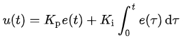
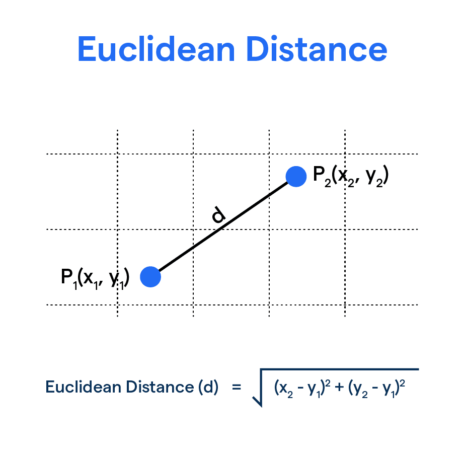
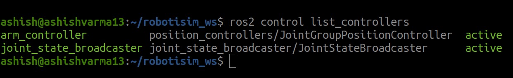
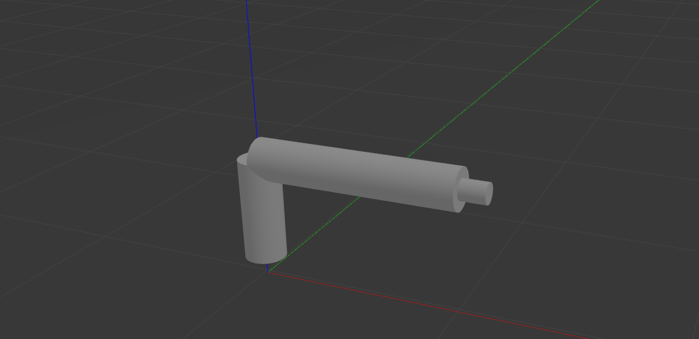
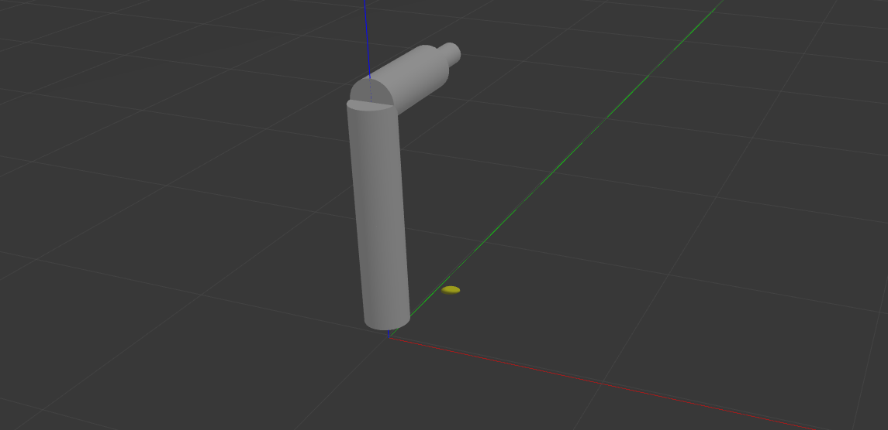
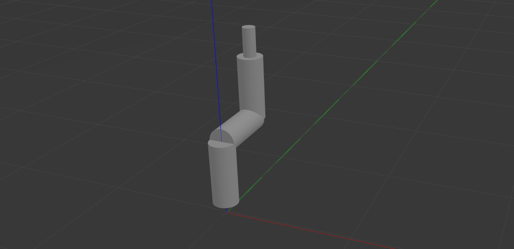
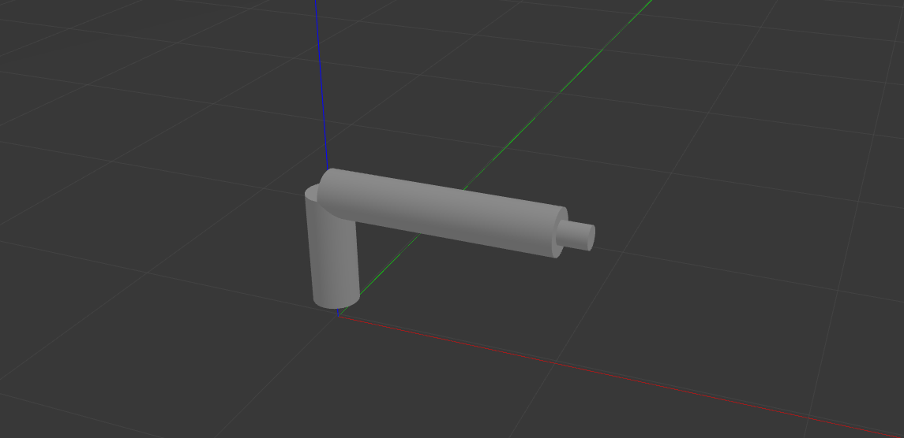

# Module 5 Assignment: Enhancing Robot Control for Smooth Motion

## Tasks

### Task 1: Improve Camera-Based Line Following

  - Improved the **speed and smoothness** of the line-following behavior by introducing a PI (Proportional-Integral) controller.
  
  

   ### How To Run?

   - Perform
      ```
      cd ~/assignment_ws
      colcon build --packages-select module_5_assignment
      source install/setup.bash
      ```
   - Run with this command
   - Termial 1
      ```
      export TURTLEBOT3_MODEL=waffle_pi
      ros2 launch module_5_assignment task1.launch.py
      ```
   ### OUTPUT
  - WATCH task1.mp4 Video (1x Speed)
  
  <video controls src="Task1.mp4" title="Title"></video>
  - Kp = 0.005, Ki = 0.0001
  - Linear Velocity = 0.5 (Constant)
  - Kp helps to reach the SetPoint(in this project it is midPoint) with minimum RiseTime.
  - Increasing Kp gives Overshoot and Undershoot.
  - Ki helps to reduce the Steady State Error.
  - Increasing Ki gives Oscillations.

### Task 2: Optimize Path Planning towards Goal

  - **Energy consumption** (Evaluated based on the distance to the goal)
  - **Shortest path to the goal**
  
  

  - **TurtleBot3's movement**
      - Orientation Correction
      - Distance Correction

   ### How To Run?

   - Perform
      ```
      cd ~/assignment_ws
      colcon build --packages-select module_5_assignment
      source install/setup.bash
      ```
   - Run with these commands
   - Termial 1
      ```
      export TURTLEBOT3_MODEL=waffle_pi
      ros2 launch turtlebot3_gazebo empty_world.launch.py
      ```
   - Termial 2
      ```
      ros2 run module_5_assignment task2
      ```
   - Termial 3
      ```
      ros2 run rqt_reconfigure rqt_reconfigure
      ```
   ### OUTPUT1
   - set_point_x = 5.0

   - set_point_y = 3.0

   - WATCH task2a.mp4 Video (1x Speed)

   <video controls src="task2a.mp4" title="Title"></video>

   ### OUTPUT2
   - set_point_x = 2.0
   
   - set_point_y = 2.0

   - WATCH task2b.mp4 Video (1x Speed)

   <video controls src="task2b.mp4" title="Title"></video>

### Task 3: Add a Position Controller to Robotic Arm URDF

   ### How To Run?

   - Perform
      ```
      cd ~/assignment_ws
      colcon build --packages-select module_5_assignment
      source install/setup.bash
      ```
   - Run with this command
   - Termial 1
      ```
      ros2 launch module_5_assignment task3.launch.py
      ```
   ### OUTPUT1
   
   
   

   - Termial 2
      ```
      ros2 topic pub --once /arm_controller/commands std_msgs/msg/Float64MultiArray "layout:
      dim: []
      data_offset: 0
      data: [-1.57, 1.57, 1.57, 0.1]"
      ```
   ### OUTPUT2
  

   - Termial 2
      ```
      ros2 topic pub --once /arm_controller/commands std_msgs/msg/Float64MultiArray "layout:
      dim: []
      data_offset: 0
      data: [1.57, 0.0, 1.57, 0.1]"
      ```
   ### OUTPUT3
  

   - Termial 2
      ```
      ros2 topic pub --once /arm_controller/commands std_msgs/msg/Float64MultiArray "layout:
      dim: []
      data_offset: 0
      data: [0.0, 0.0, 0.0, 0.0]"
      ```
   ### OUTPUT4
  

### Task 4: Implement and Visualize LQR for Multi-Goal Following

- **TurtleBot3 using LQR and analyzing the impact of different Q and R matrix values**

   ### How To Run?

   - Perform
      ```
      cd ~/assignment_ws
      colcon build --packages-select module_5_assignment
      source install/setup.bash
      ```
   - Run with these commands
   - Termial 1
      ```
      export TURTLEBOT3_MODEL=waffle_pi
      ros2 launch turtlebot3_gazebo empty_world.launch.py
      ```
   - Termial 2
      ```
      ros2 launch module_5_assignment task4.launch.py
      ```

   **Experiment with Different Q and R Values:**
   
   - Three different sets of Q and R matrices.
      - Set-1
         ```
         Q_ << 0.1, 0, 0, 0, 0.1, 0, 0, 0, 0.1;
         R_ << 0.1, 0, 0, 0.1;
         ```
         - Deviating more from the desired waypoint-4 (0, 0)
         - Least stable and robot oscillating around the waypoint-4 (0, 0)

      - Set-2
         ```
         Q_ << 0.8, 0, 0, 0, 0.8, 0, 0, 0, 0.8;
         R_ << 0.8, 0, 0, 0.8;
         ```
         - Stable and Smooth motion.
      - Set-3
         ```
         Q_ << 2, 0, 0, 0, 2, 0, 0, 0, 2;
         R_ << 2, 0, 0, 2;
         ```
         - Slower corrections compared to Set-2 

   - These Q and R values provided the best smoothness and stability in the robot’s motion compared to other values.
      - Set-2
         ```
         Q_ << 0.8, 0, 0, 0, 0.8, 0, 0, 0, 0.8;
         R_ << 0.8, 0, 0, 0.8;
         ```
---
