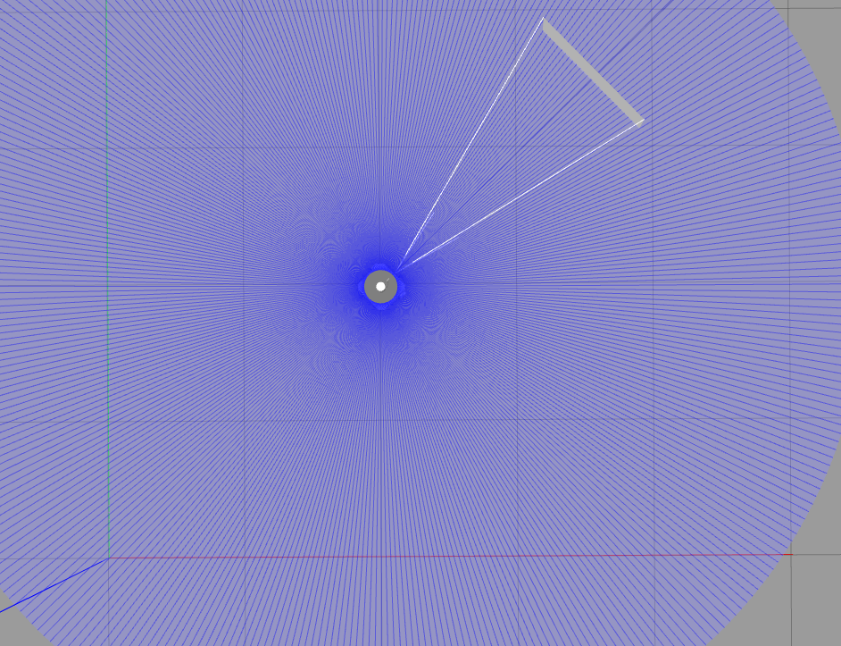
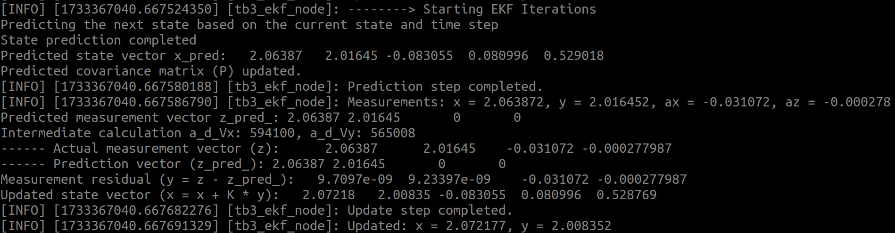
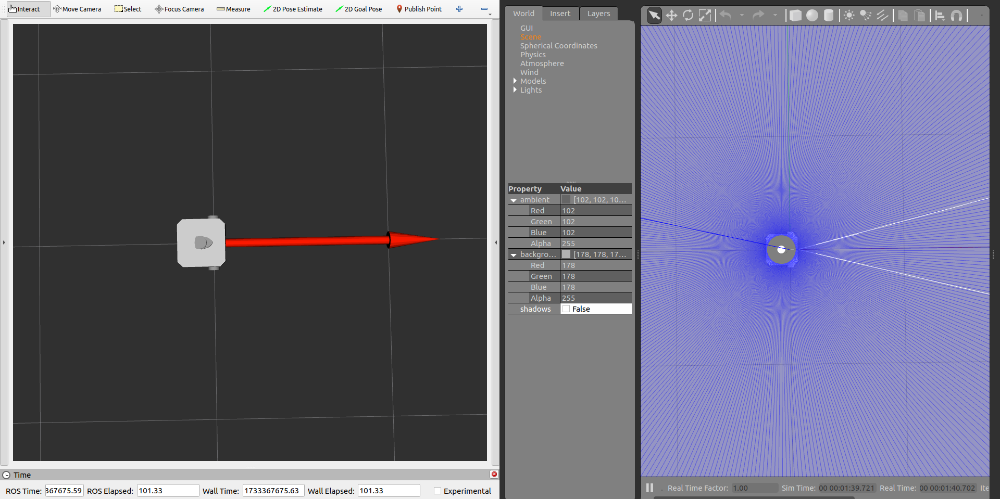
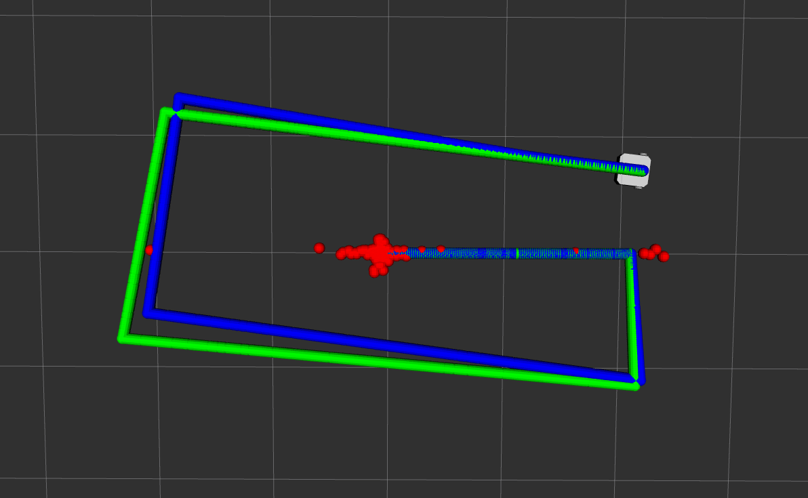
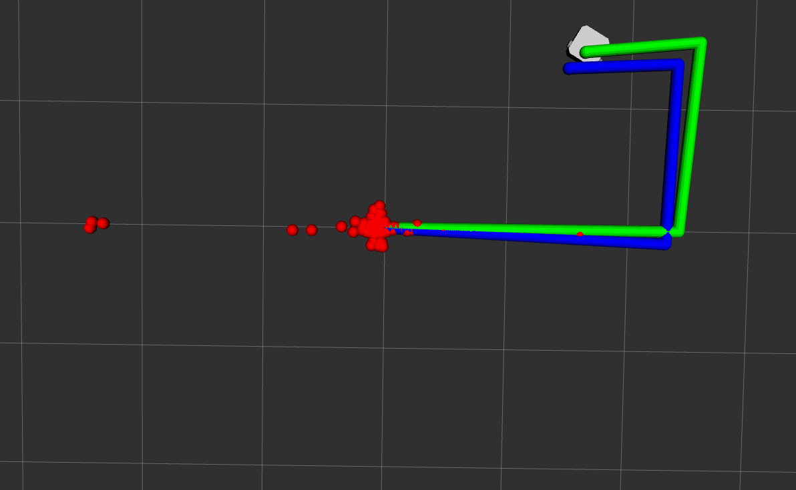
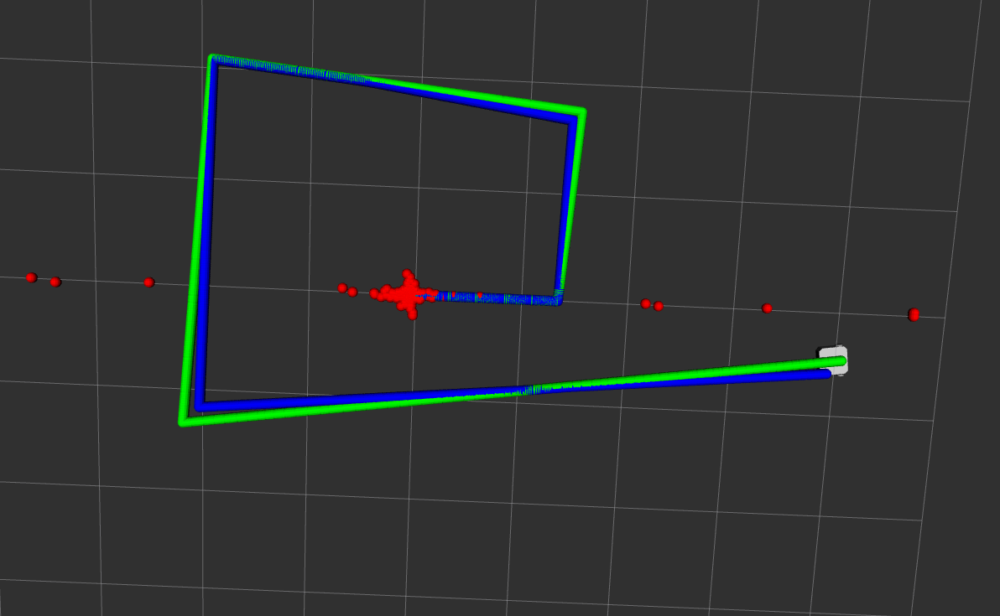

# Module 6 Assignment: IMU and GPS Sensor Fusion for TurtleBot3

## Task: Sensor Fusion for TurtleBot3

### Task Details

   - IMU Data (Linear Acceleration and Angular Velocity) - /imu topic
   - GPS Data (X, Y and Theta)   - /odom topic

1. **Sensor Fusion Node:**

   ### How To Run?

   - Perform
      ```
      cd ~/assignment_ws
      colcon build --packages-select module_6_assignment
      source install/setup.bash
      ```
   - Run with these commands
   - Termial 1
      ```
      export TURTLEBOT3_MODEL=waffle_pi
      ros2 launch turtlebot3_gazebo empty_world.launch.py 
      ```
   - Termial 2
      ```
      ros2 run module_6_assignment task1
      ```
   - Termial 3
      ```
      ros2 run teleop_twist_keyboard teleop_twist_keyboard
      ```
   ### OUTPUT
   
   

   

2. **Custom Launch File:**
   
   ### How To Run?

   - Perform
      ```
      cd ~/assignment_ws
      colcon build --packages-select module_6_assignment
      source install/setup.bash
      ```
   - Run with these commands
   - Termial 1
      ```
      export TURTLEBOT3_MODEL=waffle_pi
      ros2 run module_6_assignment task2.launch.py
      ```

   ### OUTPUT

   

3. **Visualize the Fused Data:**

   ### How To Run?

   - Perform
      ```
      cd ~/assignment_ws
      colcon build --packages-select module_6_assignment
      source install/setup.bash
      ```
   - Run with these commands
   - Termial 1
      ```
      export TURTLEBOT3_MODEL=waffle_pi
      ros2 run module_6_assignment task3.launch.py
      ```

   ### OUTPUT
   
   - RED - Raw IMU Data, GREEN - Raw Odom Data, BLUE - Fused Output Data
   - Position

   

   - WATCH task3b.mp4 Video (1x Speed)

   <video controls src="task3b.mp4" title="3b"></video>

   ### How To Run?

   - Run with these commands
   - Termial 1
      ```
      export TURTLEBOT3_MODEL=waffle_pi
      ros2 run module_6_assignment task3b.launch.py
      ```
   - Orientation

   - WATCH task3c.mp4 Video (1x Speed)

   <video controls src="task3c.mp4" title="3c"></video>

4. **Different Q Values:**
   - Q (process noise covariance)

   - Three different sets of Q and R matrices.
      - Set-1
         ```
        Q_in << 10, 0, 0, 0, 0,
                0, 10, 0, 0, 0,
                0, 0, 10, 0, 0,
                0, 0, 0, 10, 0,
                0, 0, 0, 0, 10;
         ```
         - Deviating more from odom data
         - Orientation of robot oscillating more

         

         <video controls src="task4d.mp4" title="4d"></video>

      - Set-2
         ```
        Q_in << 0.1, 0, 0, 0, 0,
                0, 0.1, 0, 0, 0,
                0, 0, 0.1, 0, 0,
                0, 0, 0, 0.1, 0,
                0, 0, 0, 0, 0.1;
         ```
         - Small Deviations in Position
         - Fluctuations in Orientation

         

         -  WATCH task4b.mp4 Video (1x Speed)

         <video controls src="task4b.mp4" title="4b"></video>

      - Set-3
         ```
        Q_in << 1, 0, 0, 0, 0,
                0, 1, 0, 0, 0,
                0, 0, 1, 0, 0,
                0, 0, 0, 1, 0,
                0, 0, 0, 0, 1;
         ```
         - Stable(Less Fluctuations) and Accurate motion compared to other values.

         
         
         -  WATCH task3c.mp4 Video (1x Speed)

         <video controls src="task3c.mp4" title="3c"></video>

5. **Results:**
   - Greater the Process Noise leads to Lower Accuracy and InStability in the system.

   - This set of Q values provided the best balance between accuracy and stability for TurtleBot3’s localization.

      ```
      Q_in << 1, 0, 0, 0, 0,
               0, 1, 0, 0, 0,
               0, 0, 1, 0, 0,
               0, 0, 0, 1, 0,
               0, 0, 0, 0, 1;
      ```
---