# Module 7 Assignment: ROS 2 Mapping with SLAM

## Tasks

### Task 1: Create a 2D LIDAR-Based Map

  - **Subtasks:**
    1. **Set Up the Maze Environment:**

         ### How To Run?

         - Perform
            ```
            cd ~/assignment_ws
            colcon build --packages-select module_7_assignment
            source install/setup.bash
            ```
         - Run with these commands
         - Termial 1
            ```
            export TURTLEBOT3_MODEL=waffle_pi
            ros2 launch module_7_assignment task1a.launch.py 
            ```
            
         ### OUTPUT
         
         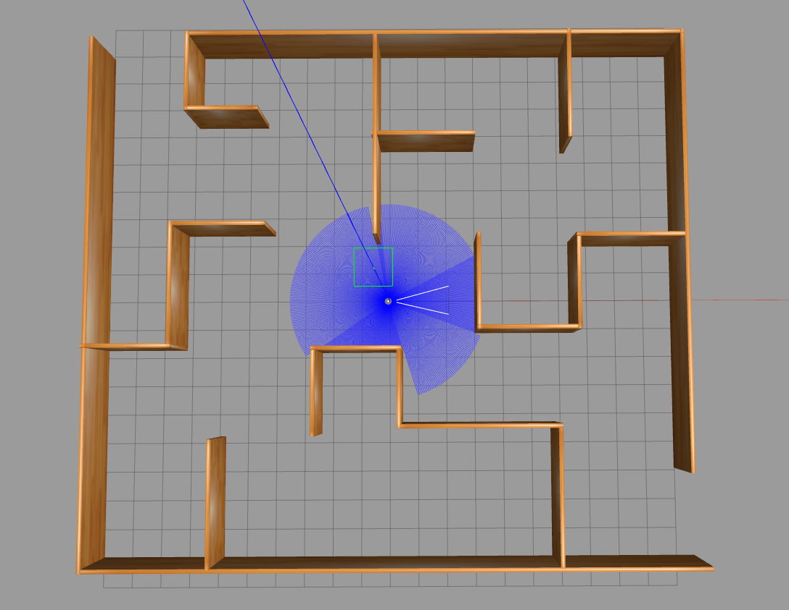

         - TF 

         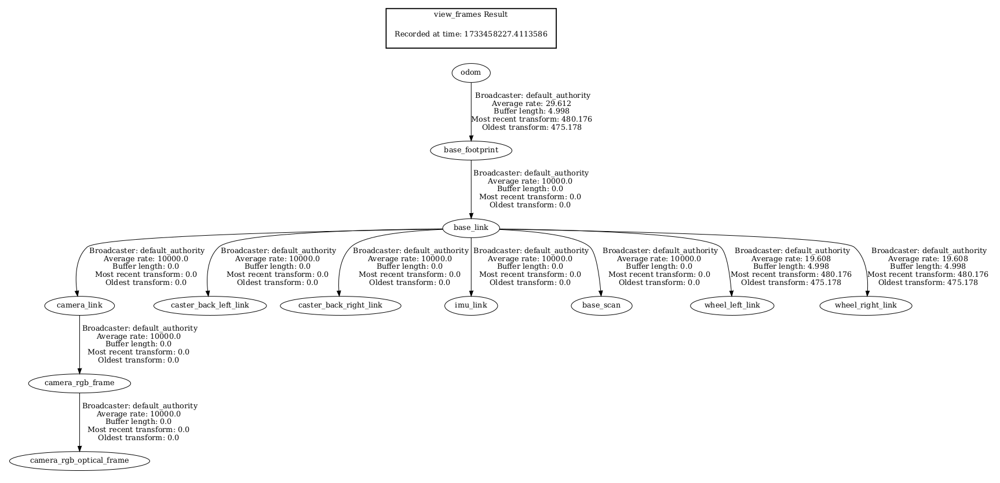

    2. **Perform 2D Mapping:**
    
         ### How To Run?

         - Run with these commands
         - Termial 1
            ```
            export TURTLEBOT3_MODEL=waffle_pi
            ros2 launch module_7_assignment task1b.launch.py 
            ```

         - Move the TurtleBot to Generate Map

         - Termial 2
            ```
            ros2 run teleop_twist_keyboard teleop_twist_keyboard
            ```

         - After Generating the Map, Save it

         - Terminal 2

            ```
            cd ~/assignment_ws/src/robotics_software_engineer/module_7_assignment/maps
            ros2 run nav2_map_server map_saver_cli -f maze_map
            ```
         - Visualize in Rviz

         - Perform
            ```
            cd ~/assignment_ws
            colcon build --packages-select module_7_assignment
            source install/setup.bash
            ```
         - Terminal 2

            ```
            ros2 launch module_7_assignment task1b.launch.py
            ```

         ### OUTPUT
         
         - TF

         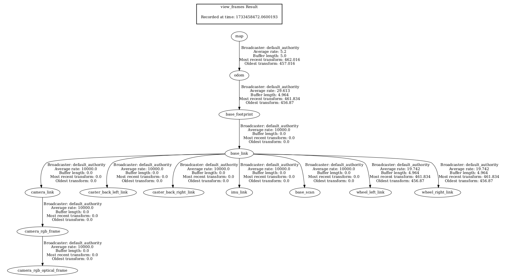

         - Map

         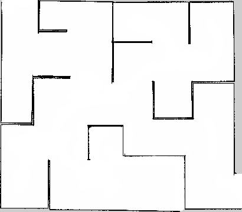

         - Rviz

         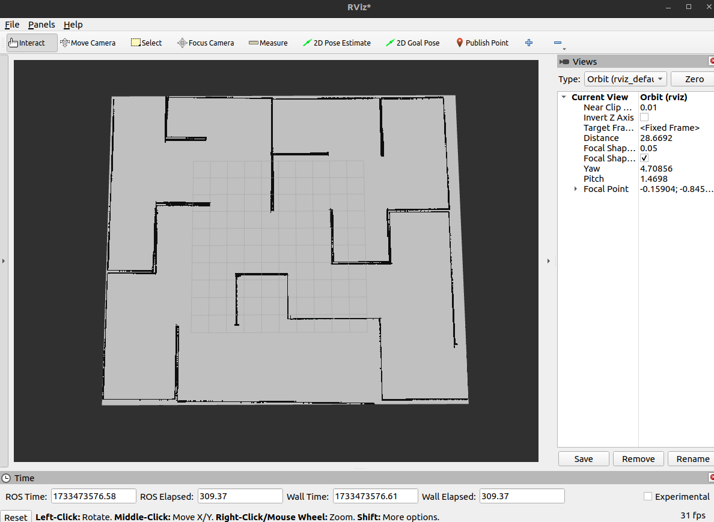

    3. **Process:**
       - How to set up the maze?

         1. Use a Gazebo Simulator to create a maze environment using Building Editor Option.
         2. Once Maze is created save model files in models folder and world file in worlds folder.
         3. Change the world name in "task1a.launch.py"
            ```
               world = os.path.join(
                  get_package_share_directory('mapping'),
                  'worlds',
                  '<your world name>.world'
               )
            ```
         4. Run "task1a.launch.py"

       - How to configure the SLAM toolbox?

         1. Install the SLAM Toolbox:

            ```
               sudo apt-get install ros-humble-slam-toolbox
            ```
         2. Open the mapper_params_online_sync.yaml file and configure the following:

            a. map_topic: The topic where the map will be published (/map by default).

            b. odom_frame: Robot's odometry frame (odom).

            c. base_frame: Robot's base frame (base_footprint).

            d. scan_topic: The topic from lidar sensor (/scan).

            e. resolution: Size of each grid cell in the generated occupancy grid map.

            resolution: 0.05 means each grid cell represents 5 cm × 5 cm in world.

       - How to generate the map?

         - Start SLAM Toolbox: Launch the configured SLAM Toolbox node.
            - Terminal 1

               ```
                  ros2 launch slam_toolbox online_async_launch.py
               ```

         - Terminal 2

            ```
               rviz2
            ```
            - Fixed Frame - map
            - Add Map by topic /map in Displays

         - Navigate the Maze: Manually drive your robot using teleoperation.
            - Ensure the lidar scans cover all parts of the maze.


            - Move the TurtleBot to Generate Map

         - Termial 3
            ```
            ros2 run teleop_twist_keyboard teleop_twist_keyboard
            ```

         - After Generating the Map, Save it
            - Use the following command to save the generated map:

            - Terminal 3

               ```
               ros2 run nav2_map_server map_saver_cli -f <map_name>
               ```
            - This saves a .yaml file and an image file .pgm representing the map.

### Task 2: Understand Inputs and Outputs for 2D and 3D Mapping using the SLAM Toolbox and the RTAB-Map Package


  - **Subtasks:**
    1. **2D Mapping with SLAM Toolbox:**

    - Inputs for 2D Mapping
         - LIDAR Data: 
            - Topic: /scan
            - Provides 2D laser scan data for obstacle detection and mapping.
            - Detects distances to obstacles in a 2D plane and creates a 2D occupancy grid.
         
         - Odometry:
            - Topic: /odom
            - Provides the robot's pose and velocity.
            - Used for estimating the robot's movement and aligning the lidar scans.

         - TF Frames:
            - Frames: odom, base_link, map
            - Transform frames for relating the robot's pose, map, and sensor data.
            - Ensures that the data from sensors is correctly referenced in the global frame.

         - Robot Description:
            - Topic: /robot_description
            - URDF providing sensor configurations.
            - Helps in sensor alignment and defining the robot's kinematics.
            
    - Outputs for 2D Mapping
         - 2D Map:
            - Topic: /map
            - Occupancy grid map (.yaml and .pgm).
            - Represents the environment as a grid of free and occupied and Unknown info cells.
            - Used for path planning and navigation.
         
         

         - TF Frames:
            - Frames: map -> odom
            - Publishes the transform between the map and odometry frames.
            - Allows navigation systems to localize within the map.

         
         
    - Role of Inputs and Outputs
         - Lidar data contributes to detecting obstacles in a 2D plane.
         - Odometry helps in estimating movement between scans.
         - Map output is used by navigation stacks for localization and motion planning.


    2. **3D Mapping with RTAB-Map:**
       
    - Inputs for 3D Mapping
         - RGB-D Camera Data: 
            - Topic: /camera/color/image_raw (RGB), /camera/depth/image_raw (Depth)
            - Provides color images and depth information for 3D mapping.
            - Captures visual and depth data for constructing 3D models.
         
         - Odometry:
            - Topic: /odom
            - Provides pose estimation using wheel encoders or visual odometry.
            - Aligns visual and depth data during robot movement.

         - TF Frames:
            - Frames: odom, base_link, map
            - Transform frames for associating sensor data with the robot's pose.
            - Ensures spatial alignment of visual, depth, and odometry data.

         - Point Clouds:
            - Topic: /camera/depth/points
            - Provides preprocessed 3D point cloud data.
            - Enhances mapping resolution and accuracy.
            
    - Outputs for 3D Mapping
         - 3D Map Data:
            - Format: OctoMap, Point Clouds, or Mesh (.pcd, .ply, .bt)
            - 3D representation of the environment.
            - Used for high-precision navigation and visualization.
         - Point Clouds:
            - Topics: /rtabmap/cloud_map, /rtabmap/proj_map
            - Stores dense or sparse point cloud data.
            - Visualizes the environment and helps in processing.
         - TF Frames:
            - Frames: map -> odom
            - Provides the transformation between the map and robot's pose.
            - Enables localization within the map.

         ***RTAB Map using Depth Camera***

         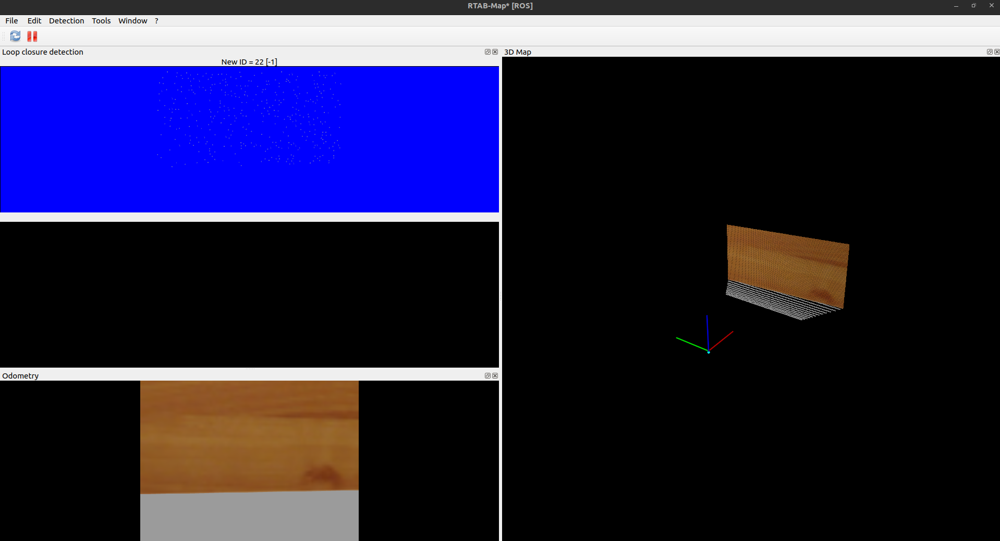

         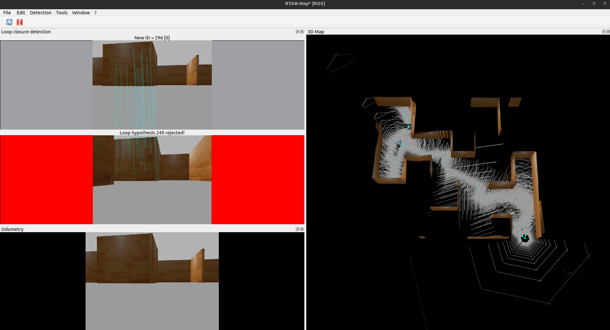
    - Processing Steps
         - RGB-D camera data is synchronized with odometry and converted into point clouds.
         - Point clouds are aligned using odometry and merged to create a global 3D map.
         - Outputs are published for visualization and usage in navigation stacks.

    3. **Compare 2D and 3D Mapping:**
       - 2D Mapping:
         - Complexity
            - Lower complexity
         - Accuracy
            - Limited to 2D representation
         - Type of environment.
            - Flat, simple environments (warehouses, offices)

       - 3D Mapping:
         - Complexity
            - Higher complexity (more data to process)
         - Accuracy
            - High accuracy in representing 3D environments
         - Type of environment.
            - Complex, 3D environments (outdoor areas, multi-level buildings)

### Task 3: Explain the Mapping Algorithm (Gmapping)

  - **Subtasks:**
    1. **How the Gmapping algorithm works for creating maps?**
       - Gmapping algorithm
         - Gmapping is a SLAM (Simultaneous Localization and Mapping) algorithm that uses a technique called particle filters to create a 2D map while simultaneously estimating the robot's location within the map.
       - Particle Filters:
         - Gmapping uses particles to represent possible robot poses (positions and orientations) in the map.
         - Each particle is a "guess" about where the robot might be.
         - Over time, particles are adjusted based on sensor data (like lidar) and robot motion.
       - Map Updating:
         - The algorithm continuously updates the map using lidar data.
         - Each lidar scan is compared with the current map, and the best match determines where the robot is.
         - The map is updated to reflect new obstacles and free spaces.
       - Handling Sensor Noise:
         - Sensors like lidar and odometry can produce noisy data.
         - Gmapping applies probabilistic methods to handle this noise, ensuring the map remains accurate.
         - It weighs particles based on how well their predicted scans match the actual sensor data.

    2. **Relate to Practical Application:**

       - ***Steps in the Gmapping Algorithm***
         1. Start with a uniform distribution of particles across possible robot poses.
         2. Assume no prior knowledge of the environment.
         3. When the robot moves, particles are adjusted based on odometry data (motion estimation).
         4. Lidar scans are used to evaluate the likelihood of each particle.
         5. Particles that better match the lidar data are given higher weights.
         6. Particles with low weights are discarded, and new particles are created near high-weight particles.
         7. The algorithm updates the 2D occupancy grid map based on the best particle's pose focusing on the most probable robot poses.
         8. Free and occupied spaces are identified using lidar data.
         9. The cycle continues as the robot moves, refining the map and its own location.


       - ***Relating to Practical Application In Task 1***
         1. Launched SLAM Toolbox: This provided a framework for real-time mapping using lidar and odometry data.
         2. Navigated the Robot: As the robot moved, lidar data fed into the Gmapping algorithm to detect obstacles.
         3. Generated a Map: The algorithm updated the occupancy grid map based on lidar scans and robot motion.

         - Initial Map

         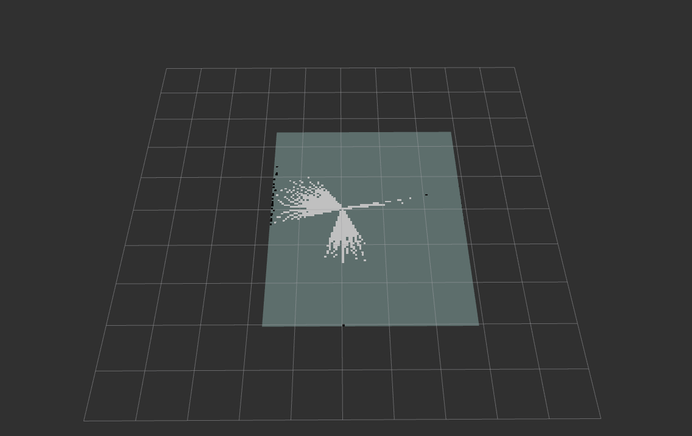

         - Final Map

         

       - Lidar data served as the primary input for mapping.
       - Odometry helped predict the robot's movement.

    3. **How Gmapping contributes to building an accurate and reliable map?**

    - Adaptive Updates:

      1. Gmapping updates the map incrementally, focusing on changes detected by lidar. This makes the map both reliable and accurate.

      ***How this works?***
      - At time t1, when the robot register some features of wall/obstacle during mapping, a sub map is created.
      - A submap is a small occupancy grid that represents an obstacle. It also record the robot's position and orientation.
      - At time t2, the robot moves a bit and the pose of robot might change and the sub map is created and register some features of wall/obstacle.
      - At each submap the robot is saving the features of obstacles, position and orientation of robot, this process is local slam.

      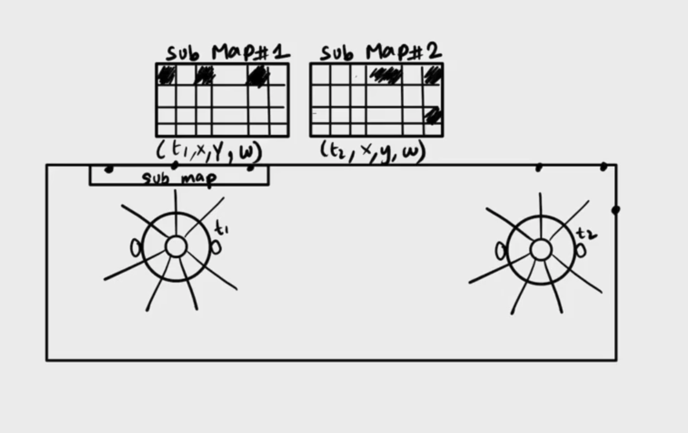

      - At t3 if there are few features of obstacle that are same as the previous submaps, then the features get overlap and loop closure happens at that specific repeated feature point.

      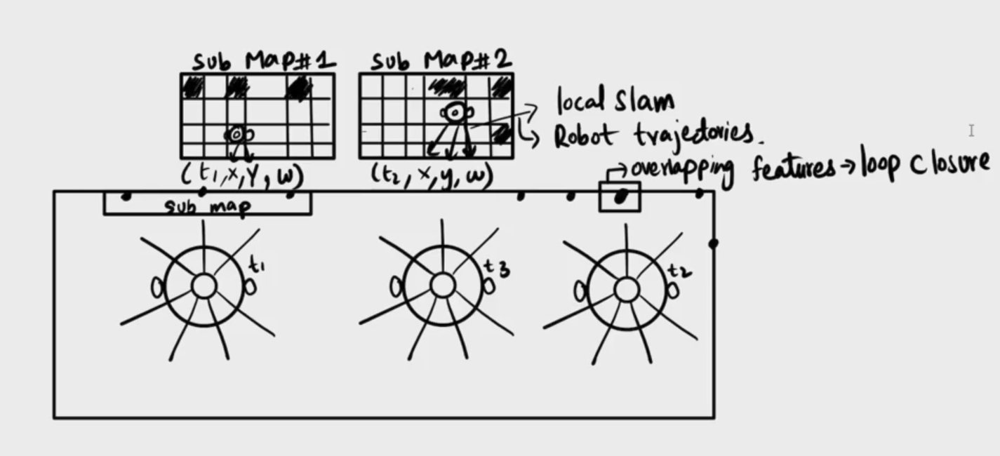

      - Loop Closure fix the error, by comparing and aligning the robot's trajectory and features at the overlapping point.

      - Now these submaps will combine into global map

      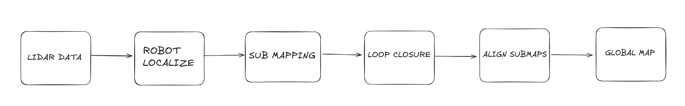
---