# Module 8 Assignment: Path Planning with A* and RRT

## Tasks

### Task 1: Compare A* and RRT Path Planning

  - **Subtasks:**
    1. **Implement Path Planning:**

            start_point_.position.x = 5.0;
            start_point_.position.y = 5.0;
            goal_point_.position.x = 0.0;
            goal_point_.position.y = 0.0;

       - A* Algorithm

         ### How To Run?

         In *path_planning.cpp* file

         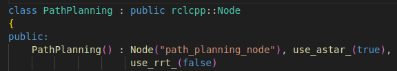

         - Perform
            ```
            cd ~/assignment_ws
            colcon build --packages-select module_8_assignment
            source install/setup.bash
            ```
         - Run with these commands
         - Termial 1
            ```
            ros2 launch module_8_assignment task1a.launch.py 
            ```

         - Visualize in Rviz

         - Perform
            ```
            cd ~/assignment_ws
            colcon build --packages-select module_7_assignment
            source install/setup.bash
            ```
         - Terminal 2

            ```
            ros2 launch module_7_assignment task1b.launch.py
            ```
            
         ### OUTPUT

         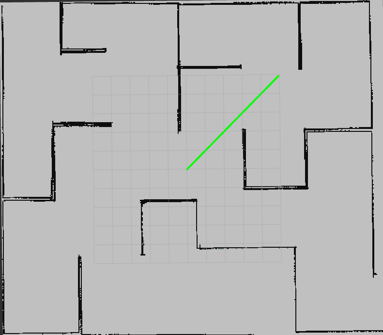

       - RRT Algorithm

         ### How To Run?

         In *path_planning.cpp* file

         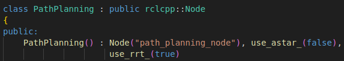

         - Perform
            ```
            cd ~/assignment_ws
            colcon build --packages-select module_8_assignment
            source install/setup.bash
            ```
         - Run with these commands
         - Termial 1
            ```
            ros2 launch module_8_assignment task1a.launch.py 
            ```

         - Visualize in Rviz

         - Perform
            ```
            cd ~/assignment_ws
            colcon build --packages-select module_7_assignment
            source install/setup.bash
            ```
         - Terminal 2

            ```
            ros2 launch module_7_assignment task1b.launch.py
            ```
            
         ### OUTPUT

         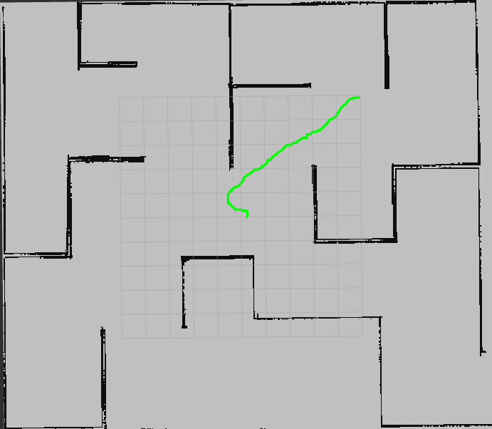

    2. **Performance:**
       - Computation Time A* < RRT
       - Success Rate A* > RRT
       - Length of Path A*(~7.1m) < RRT(>7.1m) 
       - Path Smoothness A* > RRT
       - Path Efficiency A* > RRT
   
    3. **Analysis:**
      - A*: Higher memory consumption due to storing all explored nodes, but efficient with heuristics (like Manhattan or Euclidean).
      - A* is typically faster and generates shorter, more optimal paths, especially in grid-based or static environments.

      - RRT: Computational cost increases with complexity of environment or obstacle density. Random sampling can be inefficient in narrow passages unless optimized (e.g., RRT*).
      - RRT shines in high-dimensional, complex, or non-grid environments with dynamic obstacles, though it is often slower and may generate jagged paths.
      
### Task 2: Improve RRT to RRT* for Enhanced Performance

  - **Subtasks:**
    1. **Implement RRT Star:**

            start_point_.position.x = 5.0;
            start_point_.position.y = 5.0;
            goal_point_.position.x = 0.0;
            goal_point_.position.y = 0.0;

       - RRT* Algorithm

         ### How To Run?

         In *pp.cpp* file

         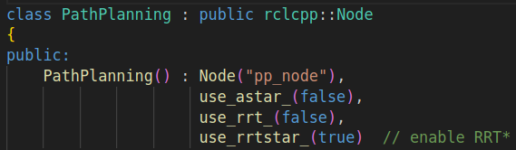

         - Perform
            ```
            cd ~/assignment_ws
            colcon build --packages-select module_8_assignment
            source install/setup.bash
            ```
         - Run with these commands
         - Termial 1
            ```
            ros2 launch module_8_assignment task2a.launch.py 
            ```

         - Visualize in Rviz

         - Perform
            ```
            cd ~/assignment_ws
            colcon build --packages-select module_7_assignment
            source install/setup.bash
            ```
         - Terminal 2

            ```
            ros2 launch module_7_assignment task1b.launch.py
            ```
            
         ### OUTPUT

         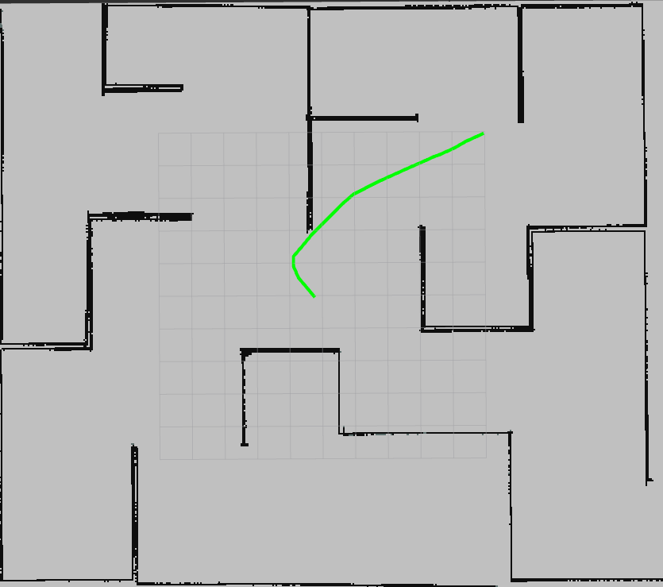

    2. **Compare with RRT & A Star:**
      
       - Path Optimality: A* (High on grid) ~ RRT* (High after rewiring) > RRT (Low to Moderate)
       - Computation Time: A* (Fast on small grids) < RRT (Very Fast) > RRT* (Slower than RRT)
       - Length of Path A*(~7.1m) < RRT(>7.1m) 
       - Memory Usage A* (High entire grid) > RRT (Low) < RRT* (Moderate)
       - Complexity Handling A* (Poor in high-dim space) < RRT (Good) < RRT* (Excellent)
       - Length of Path A*(~7.1m) < RRT* < RRT(>7.1m) 
       - Path Smoothness A* > RRT* > RRT

         | Use Case                   | Recommended Algorithm |
         | -------------------------- | --------------------- |
         | Known map with grid layout | A\*                   |
         | High-dimensional space     | RRT / RRT\*           |
         | Real-time exploration      | RRT                   |
         | Optimal path in open space | RRT\*                 |
         | Indoor mobile robots       | A\* or RRT\*          |

    3. **Document the Implementation:**

         RRT* modifies the original RRT by adding a rewiring step to improve path quality.

         RRT Algorithm

            Initialize tree with start node.

            Sample a random point from the space.

            Find the nearest node in the tree to the random point.

            Steer from nearest node toward random point by a step size.

            Check for collision in that path segment.

            Add new node to the tree if no collision.

            Repeat until goal is reached or max iterations are hit.

         - RRT is fast, but produces suboptimal and jagged paths.

         RRT* Improvements

         - Near Neighbor Search

            Instead of connecting only to the nearest node, it looks for all nodes within a certain radius r.

            Radius r shrinks as the number of samples increases.

         - Choose Parent (Best Connection)

            Among all nearby nodes, choose the one with the minimum cost (i.e., from start to the new node).

            Cost includes the path cost to the neighbor + cost from neighbor to the new node.

         - Rewire Tree

            After adding the new node, check if it can reduce the cost to reach nearby nodes.

            If so, reconnect (rewire) those nodes to the new node.

         Difference Between RRT and RRT*

         | Feature        | RRT           | RRT\*                         |
         | -------------- | ------------- | ----------------------------- |
         | Sampling       | Random        | Random                        |
         | Connection     | Nearest Node  | Best parent (lowest cost)     |
         | Optimization   | No          | Yes (rewiring step)         |
         | Path Length    | Suboptimal    | Converges to optimal path     |
         | Tree Structure | Grows quickly | Grows slower but better paths |
         | Complexity     | Lower         | Higher (due to rewiring)      |

         Why RRT* Is More Competitive with A*

         | Feature                 | A\*                       | RRT\*                                |
         | ----------------------- | ------------------------- | ------------------------------------ |
         | Optimality              | Optimal on grids          | Asymptotically optimal               |
         | Flexibility             | Grid- or graph-based      | Continuous space                     |
         | Smoothness              | Grid-induced jagged paths | Smoother (but still needs smoothing) |
         | Dynamic environments    | Hard to adapt             | Easier to adapt (sample-based)       |
         | High-dimensional spaces | Slow                      | More scalable                        |

         Why RRT* Is Better than RRT:

         - Shorter paths via rewiring

         - Better connection decisions

         - Path converges to optimal over time

         - Works in high-dimensional and continuous spaces

### Task 3: Explain and Write Unit Tests for RRT*.

  - **Subtasks:**
    1. **Detailed Explanation of RRT Star:**

         RRT Algorithm

         - Initialize tree with start node.

         - Sample a random point from the space.

         

         - Find the nearest node in the tree to the random point.

         - Steer from nearest node toward random point by a step size.

         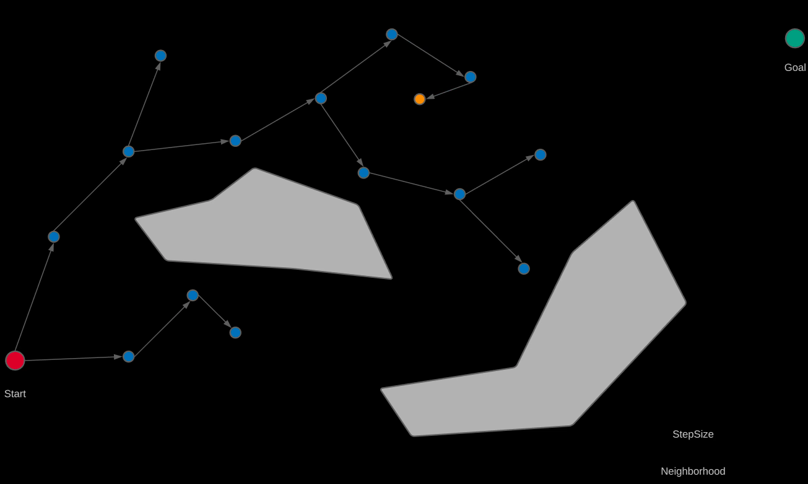

         - Check for collision in that path segment.

         - Add new node to the tree if no collision.

         - Repeat until goal is reached or max iterations are hit.

         RRT* Improvements

         

         - Near Neighbor Search

            Instead of connecting only to the nearest node, it looks for all nodes within a certain radius r.

            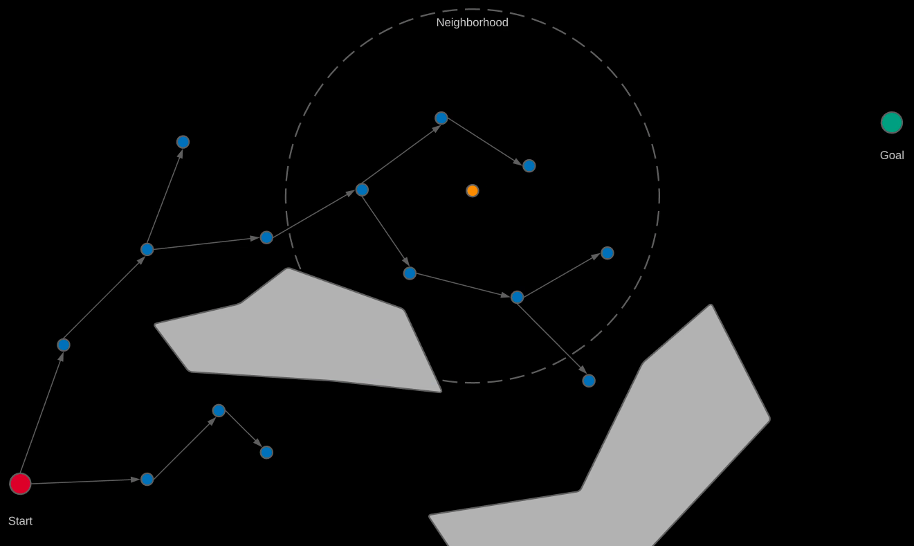

            Radius r shrinks as the number of samples increases.

         - Choose Parent (Best Connection)

            Among all nearby nodes, choose the one with the minimum cost (i.e., from start to the new node).

            

            Cost includes the path cost to the neighbor + cost from neighbor to the new node.

         - Rewire Tree

            After adding the new node
            
            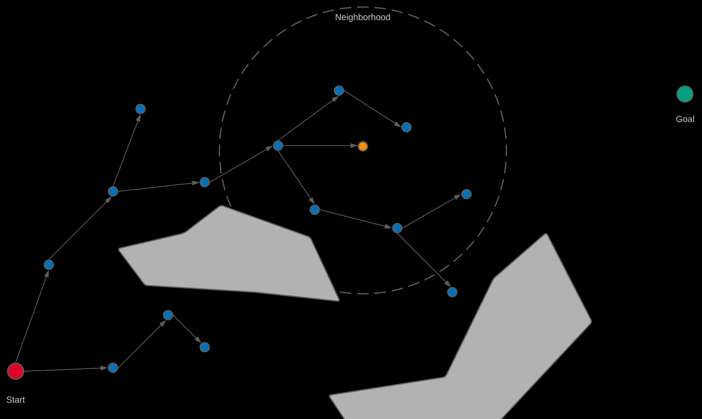

            Check if it can reduce the cost to reach nearby nodes.

            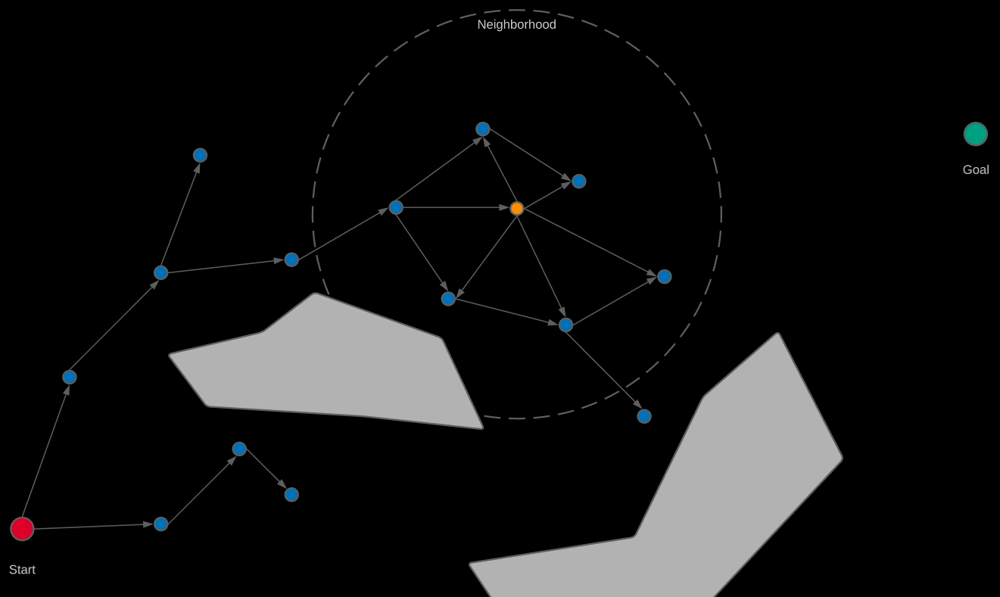

            If so, reconnect (rewire) those nodes to the new node.

            

         Reference - https://youtu.be/_aqwJBx2NFk?si=Pferx8KRYz0JeDDj

    2. **Unit Tests:**

         RRTStar Node Tests:
         ---
          - DefaultConstructor
          - ParameterizedConstructor
          - SetParent
          - SetCost
          - EqualityOperator
          - Heuristics

         RRTStar Tests:
         ---
          - GenerateRandomNode
          - FindNearestNode
          - FindNewConfig
          - IsObstacle
          - IsGoalFound
          - FindNearNodes
          - PlanPathBasic
          - NoPathDueToObstacles
          - ValidParentConnections
          - IndexToCoordinate
          - Rewire

         ### How To Run?

         - Perform
            ```
            cd ~/assignment_ws
            colcon build --packages-select module_8_assignment
            source install/setup.bash
            ```
         - Run with this command
         - Termial 1
            ```
            colcon test --packages-select module_8_assignment
            ```

    3. **Test Results:**

         ### OUTPUT

         - Run with this command
         - Termial 1
            ```
            ctest --test-dir ~/assignment_ws/build/module_8_assignment/ --output-on-failure
            ```

         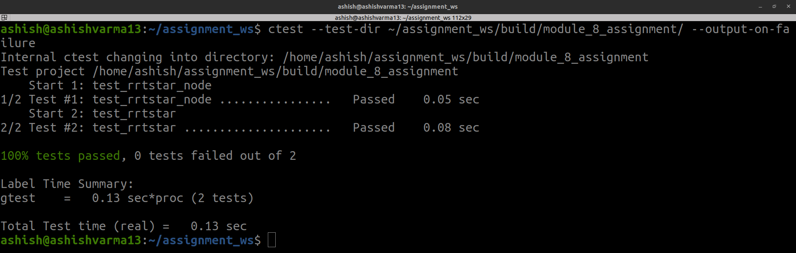
       
---
